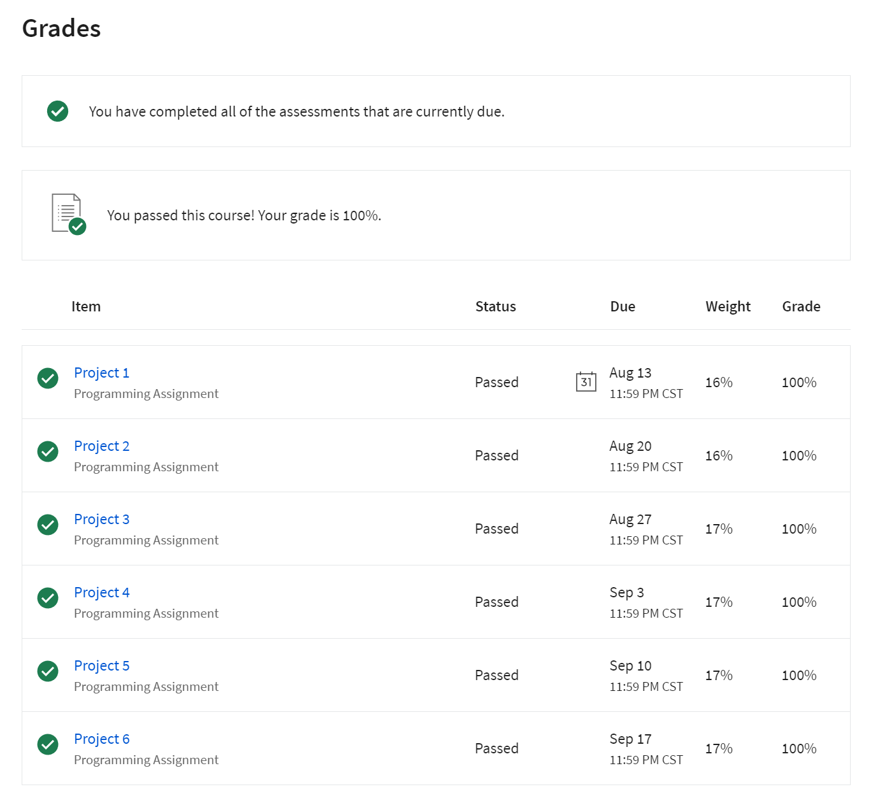
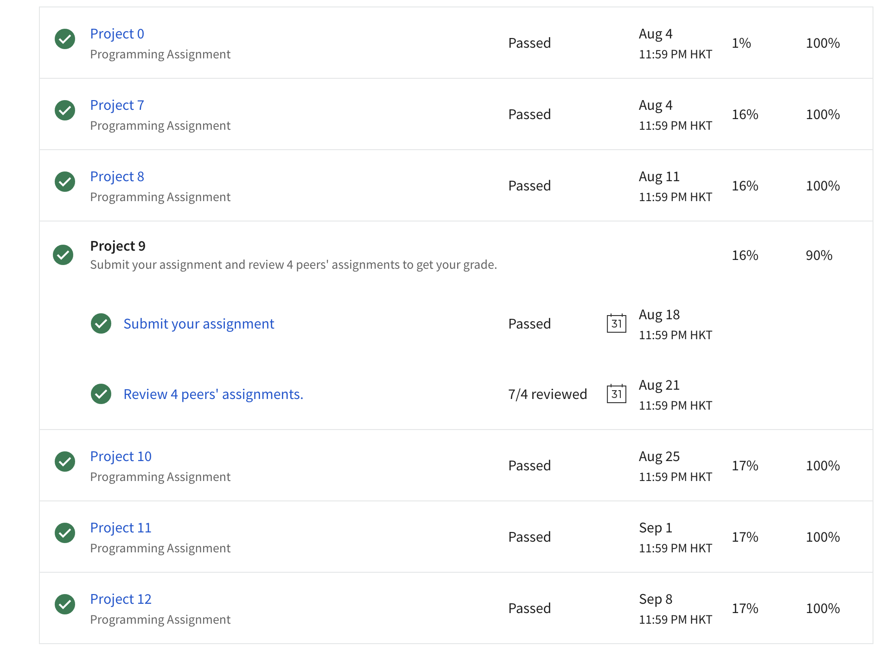
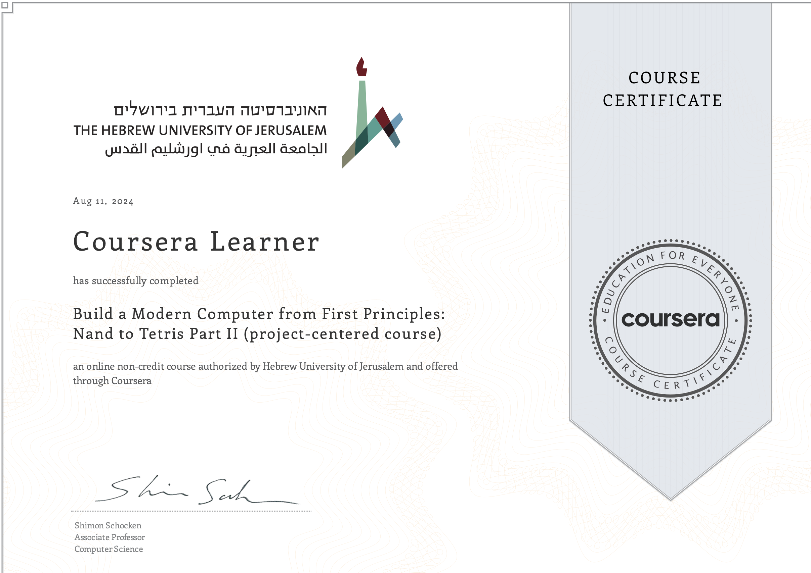

# Build-a-tiny-computer

This repository contains the course &lt; Build a Modern Computer from First Principles: Nand to Tetris> part I and II.

Task standard need time : 120 h

My total used time : （video time & lab time）

- week1: 4h + 2.5h = 6.5h
- week2: 1h + 3h  = 4h
- week3: 1h + 2h = 3h
- week4: 1.5h + 1.5h = 3h
- week5: 2.5h + 3.5h = 6h
- week6: 1.5h + 7h = 8.5h

Part I total time: **32h**, project 6 maybe the hardest one in the first part

Part II total time: **80h** without any background, project 10 and 11 can be considered the milestone for the whole course, containing front-end and back-end of a complete compiler, really good to enhancing coding capability.

## Feedback

## certificate

